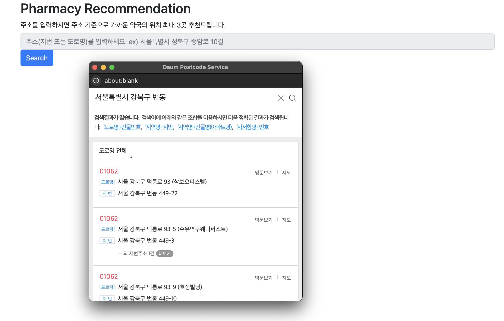

# Springboot_find-pharmacy

## 📄 프로젝트 개요

> 프로젝트 : 약국 찾기  
> 기획 및 제작 : 개인 프로젝트  
> 제작 기간 : 24.09 ~ 24.10  
> 개요 : 외부 API 와 공공 데이터를 활용합니다. 추천된 길 안내는
> 카카오 길찾기 및 로드뷰 URL 로 제공 됩니다.

## 🛠️ 기술 및 도구

## 💡 요구사항 분석

- 약국 찾기 서비스 요구사항  
    - 약국 현황 데이터를 관리하고 있다고 가정하고, 약국 현황 데이터는 위도 경도의 위치 정보 데이터를 지니고 있습니다.  
    - 해당 서비스로 주소 정보를 입력하여 요청하면 위치 기준에서 가까운 약국 3곳을 추출 합니다.  
    - 주소는 도로명 주소 또는 지번을 입력하여 요청 받습니다.  
    - 주소는 정확한 상세 주소를 제외한 주소 정보를 이용하여 추천 합니다.  
    - 입력 받은 주소를 위도, 경도로 변환 하여 기존 약국 데이터와 비교 및 가까운 약국을 찾습니다.  
    - 입력한 주소 정보에서 정해진 반경(10km) 내에 있는 약국만 추천 합니다.  

## 프로젝트 설계

- Spring Data JPA를 이용한 CRUD 메서드 구현
- Spock을 활용한 테스트 코드 작성
- Testcontainers를 활용하여 독립 테스트 환경 구축
- 카카오 주소검색 API 연동하여 주소를 위도, 경도로 변환
- 추천 결과를 카카오 지도 URL로 연동하여 제공
- 공공 데이터를 활용하여 개발
- Handlebars를 이용한 간단한 View 만들기
- 도커를 사용하여 다중 컨테이너 애플리케이션 만들기
- 애플리케이션을 클라우드 서비스에 배포
- Spring retry를 이용한 재처리 구현
- base62를 활용한 shorten url 개발
- redis를 활용하여 성능 최적화하기

## 기술 스택

- JDK 17
- Spring Boot 3.3.3
- Spring Data JPA
- Gradle
- Handlebars
- Lombok
- Github
- Docker
- AWS EC2
- Redis
- Maria DB
- Spock
- Testcontainers

## 🔎 기술적 도전

### docker-compose 를 활용한 다중 컨테이너
다중 컨테이너를 활용하면 애플리케이션을 여러 모듈로 분리할 수 있습니다. 따라서 
환경이 격리가 되고 유지보수에 있어 큰 장점이 있습니다. Dockerfile 과 docker-compose-local.yml 파일을 만들어
다중 컨테이너를 구현하였습니다.

### Spock 을 통한 테스팅
Spock 과 Groovy 의 조합은 간결하고 가독성을 높여주기에 이번 프로젝트에 도입하였습니다.
특히 where 을 통해 여러 데이터를 손쉽게 반복 테스트를 진행할 수 있었습니다.

### 거리 계산 알고리즘
사용자의 위치(위도, 경도) 를 비교하여서 가까운 약국을 찾아주기 위해 
하버사인 알고리즘을 사용하였습니다.

